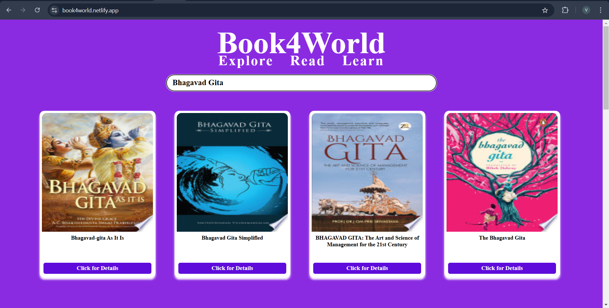
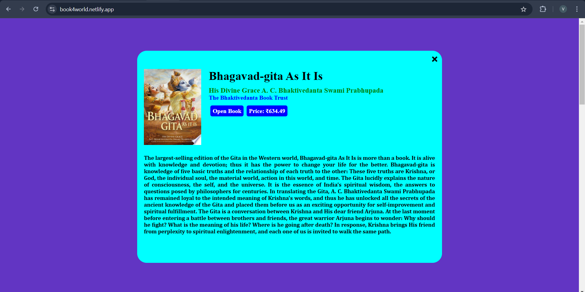
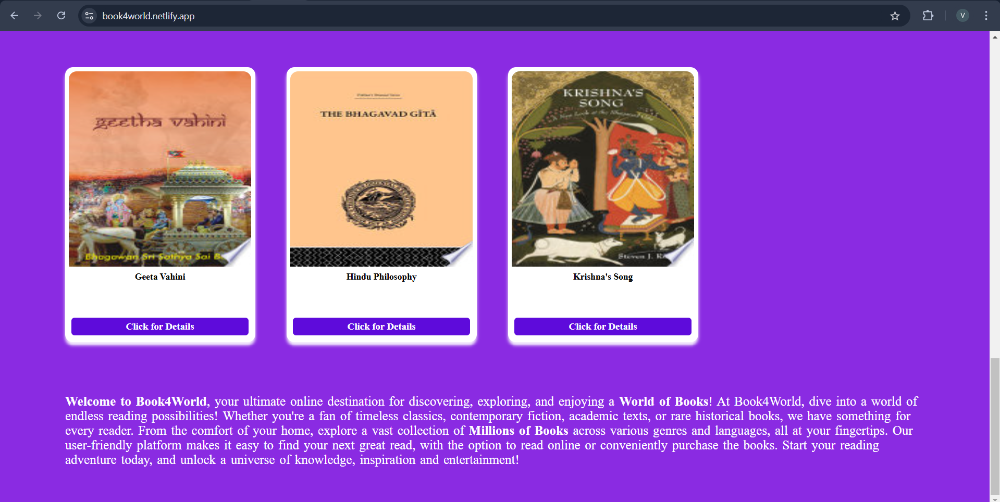

# Book4World(https://book4world.netlify.app/) 📚

**[Book4World](https://book4world.netlify.app/)** is a React-based web application that enables book enthusiasts to search for books, explore details, and discover new literary treasures. The app utilizes the **[Google Books API](https://developers.google.com/books)** to provide real-time book data, including titles, authors, descriptions, price, and more.

---

## 📑 Table of Contents

1. [🌟 Features](#-features)
2. [🔧 Tech Stack](#-tech-stack)
3. [🛠️ Installation and Setup](#️-installation-and-setup)
4. [📂 Project Structure](#-project-structure)
5. [🌐 Deployment](#-deployment)
6. [📸 Screenshots](#-screenshots)
7. [🤝 Contributing](#-contributing)
8. [📜 License](#-license)
9. [📬 Contact](#-contact)

---

## 🌟 Features

- **Search for Books**: Instantly search for books by title, author, or keywords using the [Google Books API](https://developers.google.com/books).
- **Book Details**: View detailed information about books, including descriptions, authors, price, and publication dates.
- **Responsive Design**: Enjoy a seamless experience on both desktop and mobile devices.

---

## 🔧 Tech Stack

- **Frontend**: [React.js](https://react.dev/)
- **API**: [Google Books API](https://developers.google.com/books)
- **Styling**: [CSS](https://developer.mozilla.org/en-US/docs/Web/CSS)

---

## 🛠️ Installation and Setup

1. **Clone the repository**:
   ```bash
   git clone https://github.com/vijays376/Book4World.git
   ```

2. **Navigate to the project directory**:
   ```bash
   cd Book4World
   ```

3. **Install dependencies**:
   ```bash
   npm install
   ```

4. **Create a `.env` file** in the root directory and add your Google Books API key:
   ```env
   REACT_APP_API_KEY=your_api_key_here
   ```

5. **Start the development server**:
   ```bash
   npm start
   ```

6. Open your browser and navigate to `http://localhost:3000`.

---

## 📂 Project Structure

```
/src
  /assets       # Images and other static assets
  /components   # React components
  App.js        # Main app component
  index.css     # CSS
  index.js      # Entry point
.env            # Environment variables
```

---

## 🌐 Deployment

The project can be accessed online at **[Book4World](https://book4world.netlify.app/)**.

To deploy on your own platform:  
1. Build the project:
   ```bash
   npm run build
   ```
2. Deploy the `build/` folder to your hosting service.

---

## 📸 Screenshots

### Front Page


### Book Search


### Book Description


### Footer


---

## 🤝 Contributing

Contributions are welcome! Here's how you can help:  
1. **Fork the repository**.  
2. **Create a new branch** for your feature:
   ```bash
   git checkout -b feature-name
   ```
3. **Commit your changes**:
   ```bash
   git commit -m "Add your message here"
   ```
4. **Push your changes**:
   ```bash
   git push origin feature-name
   ```
5. **Submit a pull request**.

---

## 📜 License

This project is licensed under the MIT License. See the [LICENSE](LICENSE) file for more details.

---

## 📬 Contact

For any queries or suggestions, feel free to reach out:  
- **GitHub**: [vijays376](https://github.com/vijays376)  
- **Email**: vijayschouhan376@gmail.com

